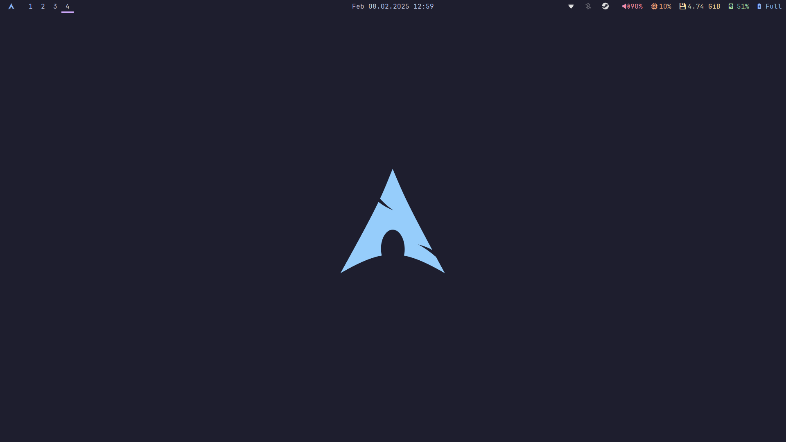
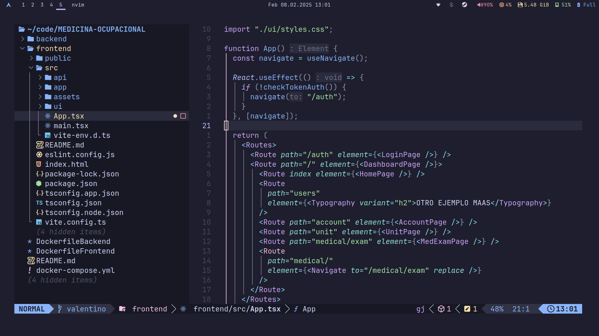
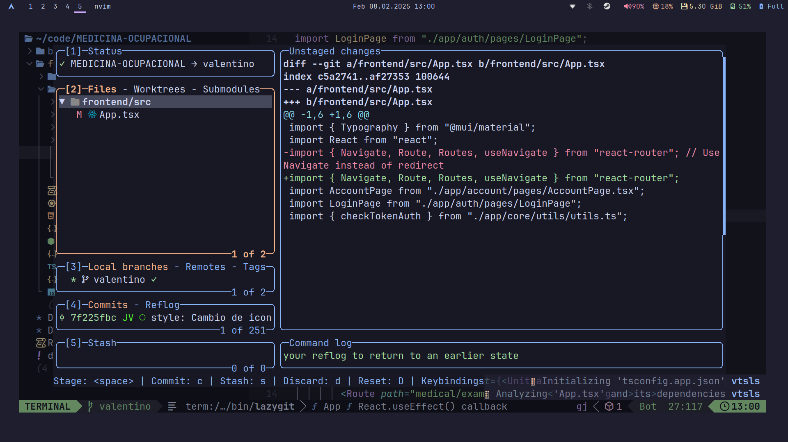

# 🖥️ Dotfiles

¡Bienvenido a mi repositorio de dotfiles! Aquí encontrarás todas las configuraciones y personalizaciones que utilizo en mi entorno de desarrollo y sistema. Este repositorio está diseñado para ser fácil de instalar y replicar en cualquier máquina.

---

## 🚀 Características

- **Configuraciones personalizadas** para:
  - Shell (`Zsh` con `Oh My Zsh`)
  - Gestor de ventanas (`i3`)
  - Barra de estado (`Polybar`)
  - Terminal (`Alacritty`)
  - Editor de texto (`Neovim`)
  - Fondo de pantalla (`Nitrogen`)
  - Y mucho más...
- **Fácil instalación** con un script automatizado.
- **Compatibilidad** con Arch Linux y derivados.
- **Drivers optimizados** para hardware AMD.

---

## 📦 Contenido

Este repositorio incluye:

- **Dotfiles**:
  - `.zshrc`: Configuración de Zsh.
  - `.gitconfig`: Configuración de Git.
  - `.config/`: Configuraciones para aplicaciones como `i3`, `polybar`, `alacritty`, `nvim`, etc.
- **Scripts**:
  - `install.sh`: Script de instalación automatizado.

---

## 🛠️ Instalación

Para instalar estas configuraciones en tu sistema, sigue estos pasos:

1. Clona este repositorio:
   ```bash
   git clone https://github.com/josvaal/dotfiles.git ~/dotfiles
   cd ~/dotfiles
   ```

2. Ejecuta el script de instalación:
   ```bash
   chmod +x install.sh
   ./install.sh
   ```

3. Sigue las instrucciones en pantalla y reinicia tu sesión cuando se complete la instalación.

---

## 🖼️ Capturas de pantalla

Aquí tienes una vista previa de mi configuración:

### Escritorio con i3 y Polybar


### Terminal Alacritty con Neovim



---

## ⚙️ Personalización

Si deseas personalizar estas configuraciones edita los archivos en `.config/` según tus preferencias.

---

## 📄 Licencia

Este proyecto está bajo la licencia [MIT](LICENSE). Siéntete libre de usarlo, modificarlo y distribuirlo.

---

